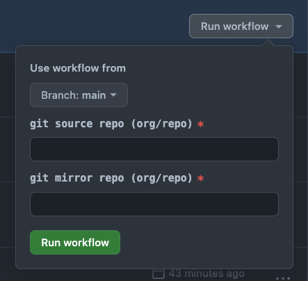
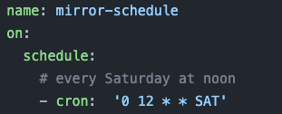

# mirror-to-github-with-actions
A `mirror.js` git repo mirroring tool coupled with GitHub Actions to simplify mirroring to GitHub from GitHub, Gitlab, or Bitbucket (cloud and enterprise).


## Basic features
- Supports all of the well known Git hosting providers
- If the repo does not exist on the target, it will be created
- If the already repo exists on the target, it will be updated
- HTTPS authentication
- Uses the following methodology to mirror the repo
```bash
git clone --bare <URL>
git push --mirror <URL>
```

### Caveats
- Does not support SSH authentication and there is unlikely to be support for it
- Does not support LFS enabled repos (yet)

## Usage
### Install
Copy and/or fork this repo into your organization and set up your secrets (org or repo) as documented below.

#### multiple mapping(csv) files
You may also want to use multiple mapping files for migration workflows. In that case add the mapping(csv) files to the repo and modify the workflow file to use the mapping file you want. You can also duplicate the workflow file. Just make sure you update the following:
- the yaml attribute `name` of the workflow 
- the workflow file name
- the path to the mapping file you want to use which currently defaults to `../../mappings.csv`
```yaml
        run: |
          cd .github/workflows
          node mirror.js --csv ../../mappings.csv
```


### Migration Flavors
#### manual mirror
You provide a source and mirror repo and it will mirror the source to the mirror repo



#### csv manual mirroring 	:chart_with_upwards_trend:
Reads a csv mapping file from the repo and mirrors the repos listed in the csv file. 

```csv
source,mirror
vercel/next.js,org/next.js
asdf-vm/asdf,org/asdf
```

#### scheduled mirroring (with csv) :timer_clock:
Reads a csv mapping file in the repo on a regular interval and mirrors repos



If you intend on using the scheduled mirror feature you may want or need to modify the schedule/cron syntax in the workflow file. Please see https://crontab.guru/ for help with the cron syntax.

## Requirements
- GitHub Actions enabled
- The ability to create a GitHub App at the source and destination GitHub Instances if you intend to mirror from GitHub Enterprise to GitHub or GitHub to GitHub Enterprise.
  - the source app will require `read` access to the repo `contents` permissions
  - the mirror app will require `read/write` access to the repo `administrative` and `contents` permissions
#### Optional Sources
- The ability to create a Bitbucket app password for a service account
  - requires `repo:read` permissions
- The ability to create a Gitlab access token for a service account
  - requires `read_repository` permissions     

### **GitHub Secrets**

After creating the source and the mirror github apps you will need to provide the following secrets:
```
  SOURCE_APP_ID             MIRROR_APP_ID
  SOURCE_INSTALLATION_ID    MIRROR_INSTALLATION_ID
  SOURCE_PEM                MIRROR_PEM 
  SOURCE_API_URL            MIRROR_API_URL
```
Note: The `SOURCE_...` settings are optional and only required if you are mirroring from GitHub.com or GitHub Enterprise Server.

### **Bitbucket Secrets**
If you intend on using bitbucket you will need the following secrets:
```
BITBUCKET_APP_CREDENTIALS <user:token>
BITBUCKET_HOST            <bitbucket.org>
```

### **Gitlab Secrets**
If you intend on using gitlab you will need the following secrets:
```
GITLAB_APP_CREDENTIALS <user:access_token>
GITLAB_HOST            <gitlab.com>
```
### **GitHub Actions**
  - It is recommended you use a linux actions runner 
  - Workflows use the following actions:
    - `actions/checkout@v3`
    - `actions/setup-node@v3`

### **mirror.js**
Mirror.js is a nodejs script that will mirror a repository from one source to another. It is used by the GitHub Actions to perform the mirroring. It is also available as a command line tool.

```
Usage: mirror.js [options]

mirror to github from github, gitlab, or bitbucket (cloud or server)

Options:
  -s, --source <source>  source repo
  -m, --mirror <mirror>  mirror repo
  -c, --csv <csv>        csv file
  -b, --bitbucket        uses bitbucket to source repos
  -l, --gitlab           uses gitlab to source repos
  -h, --help             display help for command
```


  - `mirror.js` Uses the following nodejs modules:
```
commander": "^9.4.0"
fast-csv":  "^4.3.6"
octokit":   "^2.0.7"
```
### TODO
- add testing
- add badges
- add LFS support
- expose the `http_basic_auth()` function
- refactor workflows for reusability
- support hooks (on demand updates with `repository_dispatch`)
